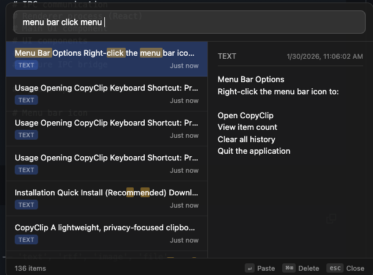

# CopyClip

A lightweight, privacy-focused clipboard manager for macOS.

---

## Screenshots

<p align="center">
  
  <br>
  <em>Clipboard history with preview pane</em>
</p>

<p align="center">
  
  <br>
  <em>Fuzzy search to quickly find items</em>
</p>

<p align="center">
  
  <br>
  <em>File preview for text files</em>
</p>

<p align="center">
  
  <br>
  <em>Image file preview</em>
</p>

---

## Features

- **Clipboard History** - Automatically saves everything you copy (text, images, RTF, and files)
- **File Copying Support** - Copy files in Finder and paste them anywhere - CopyClip remembers file contents
- **Smart Previews** - Preview text files with syntax highlighting, images inline, and file metadata
- **Fuzzy Search** - Quickly find items by typing part of the text
- **Global Hotkey** - Access your clipboard history instantly with `Cmd + Shift + C`
- **Menu Bar App** - Lives in your menu bar, always accessible but never in the way
- **Deduplication** - Identical items are merged, keeping your history clean
- **Auto-Cleanup** - Copied files are automatically cleaned up after 24 hours to save space

---

## Privacy First

**Your clipboard data never leaves your computer.**

| Feature | Description |
|---------|-------------|
| **100% Offline** | Works entirely offline. No internet connection required. |
| **No Analytics** | Zero tracking, telemetry, or usage data collection. |
| **No Cloud Sync** | Your clipboard history is stored locally on your machine only. |
| **No Account Required** | Just install and use. No sign-ups, no logins. |
| **Local Storage** | All data stored in `~/Library/Application Support/copyclip/clipboard.db` |

Your clipboard often contains sensitive information - passwords, API keys, personal messages. CopyClip ensures this data stays private by design.

---

## Installation

### Quick Install (Recommended)

1. **[Download CopyClip DMG](./release/CopyClip-1.0.0-arm64.dmg)** (Apple Silicon)
2. Open the DMG file
3. Drag CopyClip to your Applications folder
4. Launch CopyClip from Applications
5. Grant accessibility permissions when prompted (required for global hotkey)

> **Note**: Since the app is not signed with an Apple Developer certificate, you may need to right-click and select "Open" the first time, then click "Open" in the dialog.

### System Requirements

- macOS 10.13 (High Sierra) or later
- Apple Silicon (M1/M2/M3) or Intel processor

---

## Usage

### Opening CopyClip

- **Keyboard Shortcut**: Press `Cmd + Shift + C` from anywhere
- **Menu Bar**: Click the clipboard icon in your menu bar

### Keyboard Shortcuts

| Key | Action |
|-----|--------|
| `Cmd + Shift + C` | Open/close CopyClip (global) |
| `↑` / `↓` | Navigate through items |
| `Enter` | Copy selected item to clipboard |
| `Cmd + Delete` | Delete selected item |
| `Esc` | Close window |
| Type anything | Search/filter items |

### Supported Content Types

| Type | Description | Preview |
|------|-------------|---------|
| **Text** | Plain text, code snippets, URLs | Full text preview |
| **RTF** | Rich text with formatting | Text content preview |
| **Images** | Screenshots, copied images | Inline image preview |
| **Files** | Files copied from Finder | File content preview with metadata |

### File Preview Support

When you copy files in Finder, CopyClip stores the file content and provides intelligent previews:

- **Text files** (`.txt`, `.md`, `.json`, `.js`, `.ts`, `.py`, etc.) - Shows file content in a code block
- **Image files** (`.png`, `.jpg`, `.gif`, `.webp`, etc.) - Shows inline image preview
- **Binary files** - Shows file name and size
- **Large files** (>20MB) - Stores file path reference only

### Menu Bar Options

Right-click the menu bar icon to:
- Open CopyClip
- View item count
- Clear all history
- Quit the application

---

## For Developers

### Prerequisites

- Node.js 18+
- npm 9+

### Setup

```bash
# Clone the repository
git clone https://github.com/yourusername/copyclip.git
cd copyclip

# Install dependencies
npm install

# Rebuild native modules for Electron
npx electron-rebuild
```

### Development

```bash
# Run in development mode (with Vite hot reload)
npm run dev

# Or run with built files
npm run start
```

### Building

```bash
# Build all (main, preload, renderer)
npm run build

# Package as DMG
npm run package
```

### Project Structure

```
copyclip-electron/
├── src/
│   ├── main/                    # Main process (Node.js)
│   │   ├── index.ts             # App entry, lifecycle
│   │   ├── tray.ts              # Menu bar icon & menu
│   │   ├── window.ts            # Search window management
│   │   ├── hotkey.ts            # Global shortcut (Cmd+Shift+C)
│   │   ├── clipboard-monitor.ts # Polls clipboard every 500ms
│   │   ├── database.ts          # SQLite operations
│   │   ├── fuzzy-search.ts      # Search algorithm
│   │   └── ipc-handlers.ts      # IPC communication
│   ├── renderer/                # Renderer process (React)
│   │   ├── App.tsx              # Main UI component
│   │   └── components/          # UI components
│   │       ├── ClipboardList.tsx
│   │       └── PreviewPane.tsx
│   ├── preload/                 # Preload scripts
│   │   └── index.ts             # Secure IPC bridge
│   └── shared/
│       └── types.ts             # TypeScript definitions
├── resources/                   # App resources
├── screenshots/                 # README screenshots
├── release/                     # Built DMG files
├── package.json
├── tsconfig.json
├── tsconfig.main.json
├── tsconfig.preload.json
└── vite.config.ts
```

### Database Schema

```sql
CREATE TABLE clipboard_items (
  id TEXT PRIMARY KEY,
  timestamp INTEGER NOT NULL,
  content_type TEXT NOT NULL,  -- 'text', 'rtf', 'image', 'file'
  text_content TEXT,           -- Display text or filename
  raw_data BLOB NOT NULL,      -- Actual content (text, image, or file data)
  source_app TEXT,             -- Source application (if available)
  hash TEXT UNIQUE             -- SHA-256 hash for deduplication
);

CREATE INDEX idx_timestamp ON clipboard_items(timestamp DESC);
CREATE INDEX idx_content_type ON clipboard_items(content_type);
```

### Tech Stack

| Technology | Purpose |
|------------|---------|
| **Electron 28** | Cross-platform desktop framework |
| **React 18** | UI library |
| **TypeScript** | Type safety |
| **Vite** | Fast build tool with HMR |
| **better-sqlite3** | Fast, synchronous SQLite |
| **electron-builder** | Packaging and distribution |

### Key Implementation Details

#### Clipboard Monitoring
CopyClip polls the system clipboard every 500ms using Electron's `clipboard` API. When new content is detected (via SHA-256 hash comparison), it's stored in the SQLite database.

#### File Copying on macOS
macOS uses special file reference URLs (`file:///.file/id=...`) when copying files in Finder. CopyClip resolves these URLs using AppleScript/NSFileManager to get the actual file path, then reads and stores the file content.

#### File Pasting
When pasting a file, CopyClip writes the file to a temp directory and uses AppleScript to set the clipboard, which is the only reliable way to make Finder recognize file pastes.

---

## Configuration

CopyClip stores its data in:

```
~/Library/Application Support/copyclip/
└── clipboard.db    # SQLite database with clipboard history
```

### Auto-Cleanup

- **Files** are automatically deleted after 24 hours to save disk space
- **Text and images** are kept indefinitely
- Cleanup runs on app startup and every hour while running

To reset CopyClip completely, quit the app and delete the folder above.

---

## Troubleshooting

### "CopyClip can't be opened because it is from an unidentified developer"

1. Right-click on CopyClip.app
2. Select "Open" from the context menu
3. Click "Open" in the dialog

### Global hotkey not working

1. Open **System Settings → Privacy & Security → Accessibility**
2. Click the lock to make changes
3. Add CopyClip (or Electron/Terminal if running in dev mode) to the list
4. Ensure it's checked/enabled
5. Restart CopyClip

### Clipboard not being monitored

1. Restart the app
2. CopyClip polls the clipboard every 500ms and should detect changes automatically
3. Check Console.app for any error messages from CopyClip

### Files not being captured

- Only files under 20MB are stored with their content
- Files must be copied via Cmd+C in Finder (drag-and-drop is not captured)
- Verify the file exists and is readable

---

## Limitations

- **No auto-paste** - You must press Cmd+V after selecting an item
- **File size limit** - Files larger than 20MB store only the path reference
- **No sync** - No cloud sync between devices (by design, for privacy)
- **macOS only** - Currently only supports macOS
- **Single selection** - Cannot copy multiple files at once (only the first file is captured)

---

## Roadmap

- [ ] Pinned/favorite items
- [ ] Customizable hotkey
- [ ] Snippet expansion
- [ ] Categories/tags
- [ ] Export/import history
- [ ] Multiple file selection support

---

## Contributing

Contributions are welcome! Please feel free to submit a Pull Request.

1. Fork the repository
2. Create your feature branch (`git checkout -b feature/amazing-feature`)
3. Commit your changes (`git commit -m 'Add amazing feature'`)
4. Push to the branch (`git push origin feature/amazing-feature`)
5. Open a Pull Request

---

## License

MIT License - feel free to use, modify, and distribute.

---

## Acknowledgments

Built with privacy in mind. Your data belongs to you.

---

<p align="center">
  <strong>CopyClip</strong> - A clipboard manager that respects your privacy.
</p>
